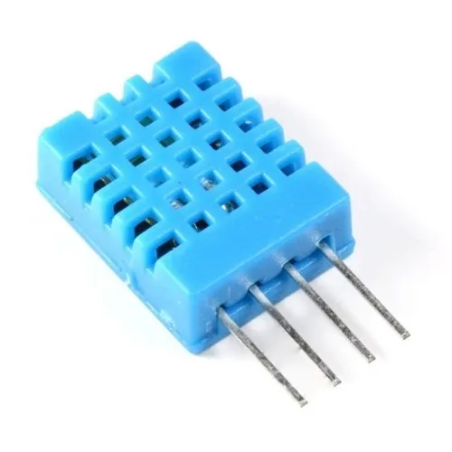

<h1 align="center">House Iot API</h1>

  

    <strong>A simple API to retrieve IoT devices measurements</strong>
  

## About

For now the API has endpoints to receive measurementes of Dht11 (Temperature em Humidity Sensor) and Luminosity sensor Photoresistor GL5528 LDR THT.

 
 

